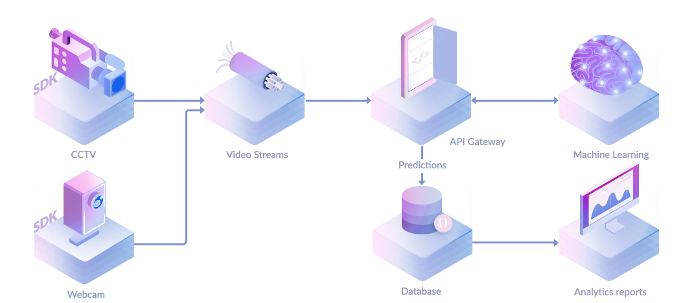

# WebSocket Streams

Nvision cloud service provides two types of APIs. With our flexible API protocols across **RESTful** for synchronized **image** processing and **WebSocket** for real-time **video** analysis with a stream processing. Learn more, [what is Nvision API](https://nvision-docs.nipa.cloud/#what-is-the-nvision-api). Integrating our machine learning services into your technology stack has never been easier. Ranging from edge applications to back-end services.

Both image and video processing support the same API services which can detect and recognize labels with a wide range of categories. For more information about the machine learning services provided by the Nvision API, see [features lists](https://nvision-docs.nipa.cloud/machine-learning-services).

### Nvision Video Streaming

Using Nvision service can help you extract a lot of information regarding the environment using just a simple camera. With [WebSocket](https://en.wikipedia.org/wiki/WebSocket) protocol provided in our edge SDKs, you can efficiently stream video feeds to Nipa Cloud Platform for real-time video analytics.

WebSocket enables streams of video frames on top of TCP and promotes real-time data transfer from and to the server. This is made possible by providing a standardized way for the client to send content to the server while keeping the connection open. 

Nvision video streaming is **asynchronous**. The following diagram shows the processing pipeline in a streaming video.

As the socket protocol is used, we provide a custom **callback endpoint** configuration that allows you to have independent backends for analyzing and saving prediction results.

For instance, you develop a **headless javascript** running on edge computes \(i.e., publisher\) to stream video feeds to Nvision service. The callback endpoint is designed to facilitate the streaming pipeline that allows you to directly receive predictions to your target server \(i.e., subscriber\), without having to return to the publishers.

**To use Nvision with streaming videos,** your application needs to implement the following:

* NCP Portal: set up your endpoints in the created Nvision service page.
* Client: develop websocket stream using SDK with your API key.
* Server: create a webhook url \(callbacks\) to receive HTTP POST requests from Nvision service.

For more information, see [a video streaming quickstart](https://nvision-docs.nipa.cloud/quickstarts/make-a-websocket-stream).

