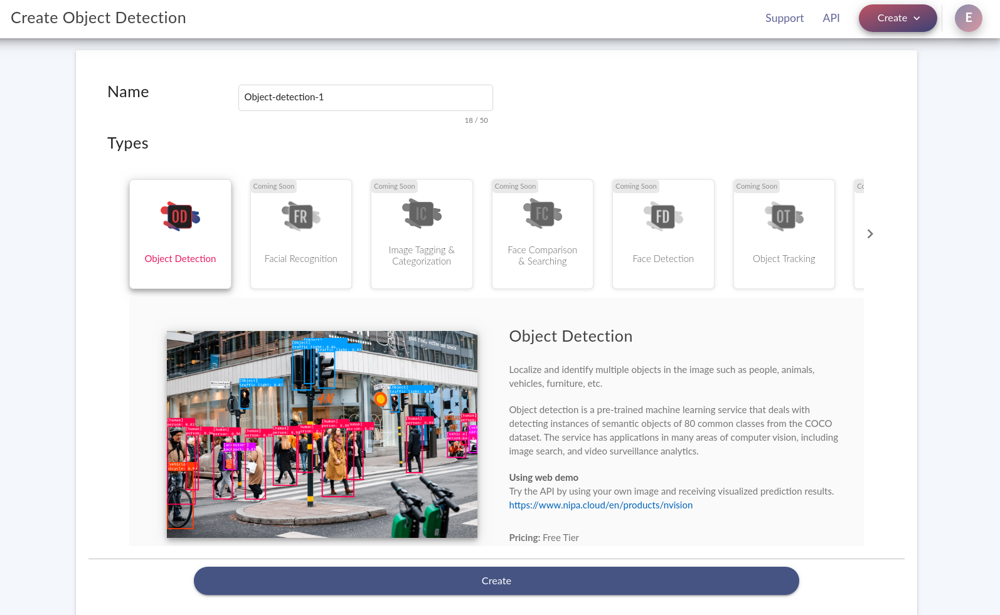

# Detect Objects

You can use the Nvision’s **Object Detection** service to detect labels in an image. this service localizes and identifies multiple objects in the image such as people, animals, vehicles, and furniture. see [machine learning services](https://nvision-docs.nipa.cloud/machine-learning-services).


A response is returned in JSON format similar to the following example:  


```javascript
{
    "detected_objects": [
        {
            "confidence": 0.8327999711036682,
            "parent": "accessory",
            "bounding_box": {
                "left": 246,
                "right": 303,
                "top": 520,
                "bottom": 605
            },
            "name": "backpack"
        },
        ...
        {
            "confidence": 0.6195999979972839,
            "parent": "Object",
            "bounding_box": {
                "left": 595,
                "right": 641,
                "top": 64,
                "bottom": 230
            },
            "name": "traffic light"
        }
    ]
}
```


If you **have not created a Nvision service** account credentials, do so now in this [set up the Nvision service](https://nvision-docs.nipa.cloud/quickstarts/set-up-the-nvision-api) quickstart for instructions. 




Once your service has been created, go to the service overview page under API Key to get your service key.

## Detect objects in an image

### Image Content

The Nvision API can perform object detection on a local image file by sending an image as a **base64 encoded** **string** in your request body.

The [base64](https://en.wikipedia.org/wiki/Base64) encoded string is a binary-to-text encoding that represents binary data in an ASCII **string** format as the following example: `/9j/4AAQSkZJRgABAQEBLAEsAAD...`

### JSON Request Body

The API is accessible via the HTTP method and URL, see :

**`POST`** `https://nvision.nipa.cloud/api/object-detection`

```javascript
{
    "raw_data": <<BASE64_ENCODED_IMAGE>>,
    "configurations": [
        {
            "parameter": "OutputCroppedImage",
            "value": "false"
        },
        {
            "parameter": "ConfidenceThreshold",
            "value": "0.1"
        }
    ]
}
```

The configuration is different on individual service types. It is structured as a key-value mapping. A config name is defined in **`parameter`** field and the corresponding value is defined in **`value`** field in **string format**.  
  
For object detection service, there are two available configurations as follows:

* **`OutputCroppedImage`**: to return cropped images from bounding box detections.
  * Value options: `"true"` or `"false"`
  * Default: `"false"`
* **`ConfidenceThreshold`**: to define the minimum confidence score of the prediction results.
  * Value options: `[0, 1]`
  * Default: `"0.1"`

## Make a RESTful Call

 You can call this API through REST calls or native SDKs. 

### **Using the cURL command line**

```bash
export API_KEY="<<YOUR_API_KEY>>"

# save the json request body as a file named request.json
curl -X POST \
https://nvision.nipa.cloud/api/object-detection
-H 'Authorization: ApiKey '$API_KEY \
-H 'Content-Type: application/json' \
-d @request.json | json_pp

# or read a local image from filepath
echo -n '{"raw_data": "'"$(base64 image.jpg)"'"}' | \
curl -X POST \
https://nvision.nipa.cloud/api/object-detection \
-H 'Authorization: ApiKey '$API_KEY \
-H "Content-Type: application/json" \
-d @- | json_pp
```

### **Using the client libraries**

Nvision SDKs provide interface for calling Nvision services in your own language.

#### **Installation**

* For python, using pypi package here: [https://pypi.org/project/nvision/](https://pypi.org/project/nvision/)
* For nodejs, using npm package here: [https://www.npmjs.com/package/@nipacloud/nvision](https://www.npmjs.com/package/@nipacloud/nvision)



```bash
pip install nvision
```



```bash
npm i @nipacloud/nvision
```



#### Example Usage

See the [SDK Reference](https://nvision-docs.nipa.cloud/api-references/python-sdk), in this guide, covers calling Nvision API for **Python** and **JavaScript**.



```python
import os
import json
import base64
from nvision import ObjectDetection

model = ObjectDetection(api_key='YOUR_API_KEY')

# base64 encoed string
with open('image.jpg', 'rb') as file:
    image = file.read()
    image = base64.b64encode(image).decode('utf-8')

# make a RESTful call to the Nvision API
response = model.predict(image)

# get the predictions (in JSON format) from the response
print(json.dumps(response.json(), indent=4, sort_keys=True))
```



```

```



## Detect Object in a video

An example of how to integrate `@nipacloud/nvision` SDK to the frontend app.  
[https://github.com/nipa-cloud/nvision-browser-example](https://github.com/nipa-cloud/nvision-browser-example)

### Set up the SDK with Webpack

Nvision SDK comes with a built-in TypeScript definition. You can configure Webpack alias to point to the browser variant of the library.



```javascript
{
  ...
  resolve: {
    alias: {
      "@nipacloud/nvision": "@nipacloud/nvision/dist/browser/nvision.js"
    }
  }
  ...
}
```



